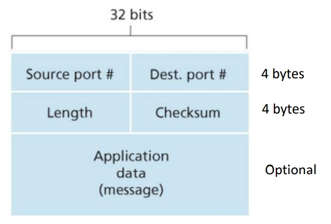

## 질문

<details>
<summary>UDP와 TCP의 소켓 식별 방법 차이</summary>

UDP: (목적지 IP 주소, 목적지 포트 번호)

TCP: (출발지 IP, 출발지 포트, 목적지 IP, 목적지 포트)

UDP는 하나의 소켓으로 모든 요청 처리


</details>



<details>
<summary>UDP 세그먼트 사진을 보면 출발지, 목적지 IP 주소가 없다 왜그런 것인가?</summary>
```go
애플리케이션 계층
        ↓
트랜스포트 계층: TCP, UDP
        ↓
네트워크 계층: IP <-- 네트워크 계층에서 IP 헤더를 더해줍니다.
        ↓
링크 계층: Ethernet, Wi-Fi 등
```

</details>

<details>
<summary>링크 계층에서 오류검사를 제공하는데 왜 UDP(트랜스포트 계층)는 체크섬 검사를 하는가?</summary>
링크 계층의 오류 검사는 보통 각 링크마다 수행됩니다.
각 구간마다 링크 계층 프레임은 새로 만들어집니다.

```go
구간 1: 노트북 → 공유기
[프레임 A | 그 안에 IP 패킷]

구간 2: 공유기 → 통신사 라우터
[프레임 B | 그 안에 같은 IP 패킷]

구간 3: 라우터 → 라우터
[프레임 C | 그 안에 같은 IP 패킷]

구간 4: 마지막 라우터 → 서버
[프레임 D | 그 안에 같은 IP 패킷]
```

라우터를 지날 때마다 기존 프레임은 벗겨지고, 다음 링크에 맞는 새 프레임으로 다시 포장됩니다.

링크계층에서 프레임 오류 검사는 “이 구간에서 프레임이 깨졌나?” 를 검사합니다.

반면 UDP 체크섬은 “최종 목적지까지 온 UDP 데이터가 깨지지 않았나?” 을 검사합니다.
</details>

<details>
<summary>UDP와 TCP의 소켓 식별 방법 차이</summary>

UDP: (목적지 IP 주소, 목적지 포트 번호)

TCP: (출발지 IP, 출발지 포트, 목적지 IP, 목적지 포트)

UDP는 하나의 소켓으로 모든 요청 처리


</details>

<details>
<summary>데이터파이프라이닝에서 2번 째 패킷이 있을 때 3,4 번째 패킷에 대해서 어떻게 처리하는가?</summary>

## 1. Go-Back-N 방식

Go-Back-N에서는 수신자가 **순서대로 온 패킷만 인정**합니다.

예를 들어 송신자가 파이프라이닝으로 이렇게 보냈다고 해볼게요.

```
송신자 → 수신자

packet 1
packet 2  ← 손실 또는 오류
packet 3
packet 4
packet 5
```

수신자 입장에서는 `packet 1`은 정상적으로 받았습니다.

그런데 `packet 2`가 없는데 `packet 3`, `packet 4`가 도착하면?

```
packet 3 도착 → "나는 아직 packet 2를 기다리는데?"
packet 4 도착 → "아직도 packet 2가 안 왔는데?"
```

Go-Back-N에서는 보통 **3, 4번 패킷을 버립니다.**

그리고 수신자는 계속 이렇게 말합니다.

```
ACK 1
ACK 1
ACK 1
```

또는 표현에 따라 “다음으로 기대하는 것은 2번”이라는 ACK를 보냅니다.

송신자는 2번 패킷의 타이머가 만료되면:

```
packet 2
packet 3
packet 4
packet 5
```

처럼 **2번부터 다시 전송**합니다.

즉, Go-Back-N은 이름 그대로:

```
문제 생긴 패킷부터 뒤로 돌아가서 다시 보냄
```

입니다.

## 2. Selective Repeat 방식

Selective Repeat에서는 수신자가 순서가 어긋난 패킷도 **버리지 않고 버퍼에 저장**할 수 있습니다.

같은 상황을 보겠습니다.

```
packet 1
packet 2  ← 손실 또는 오류
packet 3
packet 4
```

수신자는 `packet 2`가 빠진 것을 알지만, `packet 3`, `packet 4`가 정상적으로 도착했다면 버퍼에 저장합니다.

```
수신 버퍼:
packet 3 저장
packet 4 저장
```

그리고 각각에 대해 ACK를 보낼 수 있습니다.

```
ACK 3
ACK 4
```

송신자는 2번 패킷만 문제가 있다고 판단하면:

```
packet 2만 재전송
```

합니다.

그 후 수신자가 `packet 2`를 받으면, 이미 저장해 둔 `packet 3`, `packet 4`와 함께 순서대로 애플리케이션에 넘깁니다.

```
packet 2 수신
→ packet 2, packet 3, packet 4 순서대로 전달
```

## 비교하면

| 상황 | Go-Back-N | Selective Repeat |
| --- | --- | --- |
| 2번 패킷 손실 | 3, 4번이 와도 버림 | 3, 4번을 버퍼에 저장 |
| ACK 방식 | 마지막으로 순서대로 받은 패킷까지 ACK | 각각의 패킷에 대해 ACK |
| 재전송 | 2번부터 다시 전송 | 2번만 재전송 |
| 수신 버퍼 | 단순함 | 더 필요함 |
| 효율 | 낮을 수 있음 | 더 효율적 |

</details>